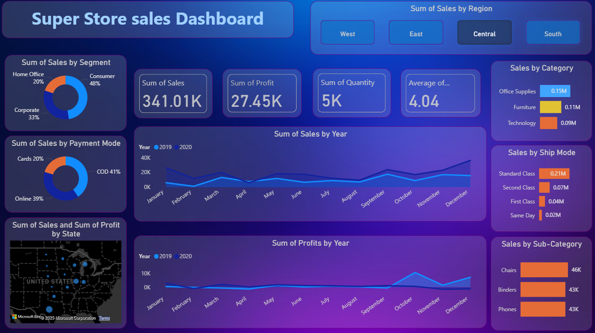

# SUPER_SALES_DASHBOARD(Power BI)
# Sales Dashboard 

This project is a dynamic and interactive **Sales Dashboard** built using **Power BI**, which helps visualize and analyze key sales performance metrics from a retail e-commerce dataset.

---

## 📁 Project Files

- `sales dashboard.pbix` – Power BI report file
- `sales_data.csv` – Raw data used in the dashboard
- `dashboard.png` – Screenshot of the Power BI dashboard
- `README.md` – Project documentation

---

## 📌 Features

- ✅ Sales KPIs: Total Sales, Orders, Profit
- 📅 Monthly and Yearly Sales Trend
- 📍 Sales by Region and City
- 🛍️ Product Category and Subcategory Analysis
- 👤 Customer Segment Insights
- 🎯 Interactive Slicers and Filters

---

## 🧠 Skills Demonstrated

- Data Cleaning in Power Query
- Data Modeling and Relationships
- DAX Measures (Sales, Profit, Discounts, Quantity)
- Visualizations: Bar Chart, Line Chart, Map, Card, Tree Map, Pie Chart
- Dashboard Design and Layout

---

## 🛠️ Tools Used

- Power BI Desktop
- Power Query Editor
- DAX (Data Analysis Expressions)
- Microsoft Excel (for CSV preparation)

---

## 🚀 How to Use

1. Open `sales dashboard.pbix` in Power BI Desktop.
2. Connect or load the `sales_data.csv` if prompted.
3. Explore the visuals and insights.

---
